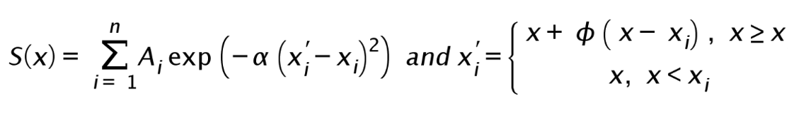
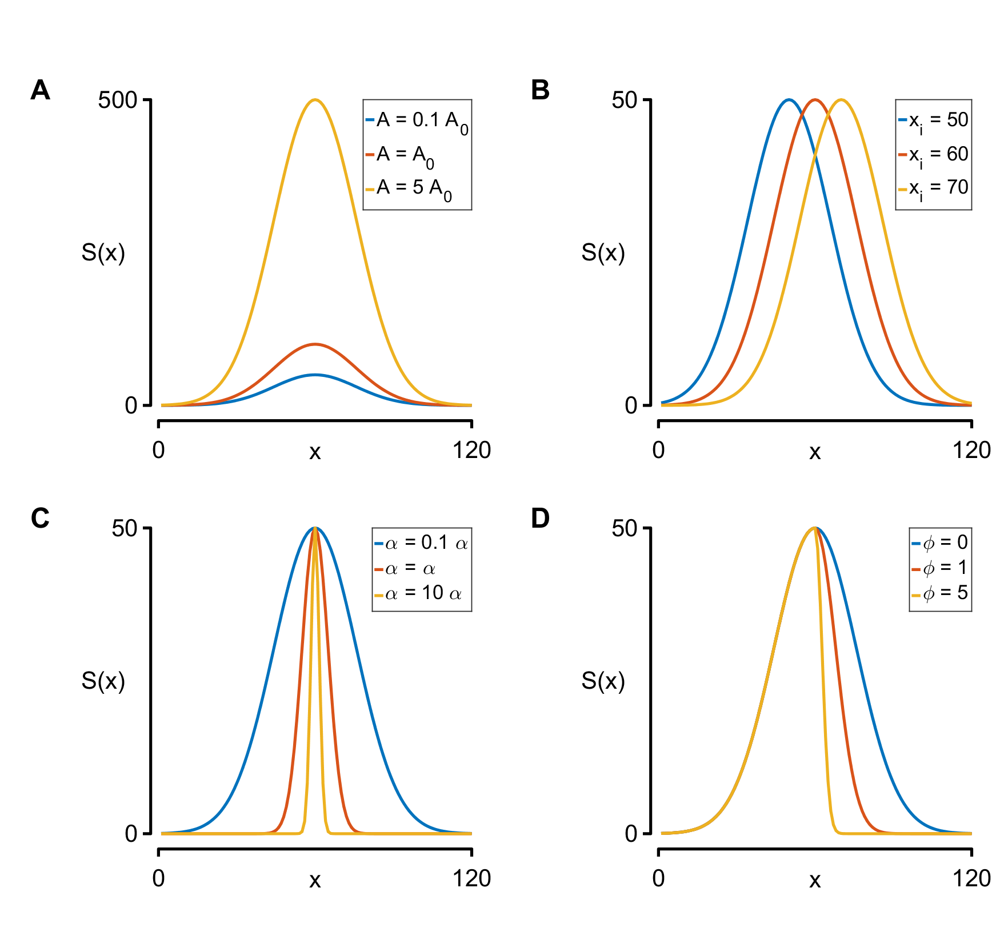
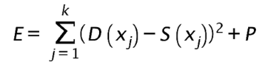
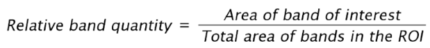

# Methods

GelBox 3 fits the summation of Gaussian functions to the densitometry profile using a workflow that is similar to [GelBandFitter](https://campbell-muscle-lab.github.io/GelBandFitter/). Such mathematical function is defined as follows: 

where x is the position along the height of the region of interest (ROI), n is the number of bands, Ai and xi are the peak amplitude and its location, respectively, α determines the curvature, and ϕ is the skewness parameter. 

Each parameter alters the shape of the function. While the peak amplitude sets the maximum value, its location shifts the curve along the x direction (Panel A and B in below figure). As the α parameter increases, the width of the curve decreases (Panel C in below figure). A non-zero skewness parameter allows the function to be asymmetric (Panel D in below figure). GelBox 3 assigns identical shape and skewness parameters to functions assuming the proteins run in similar shapes. This assumption can be overwritten through adjustable starting parameter estimates.

GelBox 3 adjusts the parameters for each Gaussian function until the minimum residual sum of squares of the density profile and fitted function is obtained. Such objective function is defined as follows:

where k is the number of pixels in the ROI, D(x) is the densitometry profile, S(x) is the fitted function at the end of each iteration, and P is the penalty. A penalty condition is applied to prevent the following occurrences: negative parameter value, negative area, negative function value, and peak location having a value beyond the ROI. Each Gaussian function is then numerically integrated to find the areas. Generalized relative band content expresiion is given as follows:

