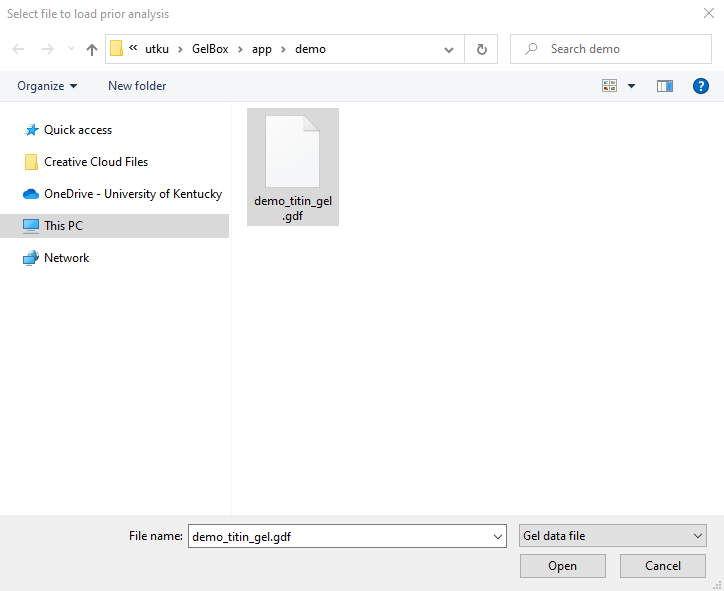
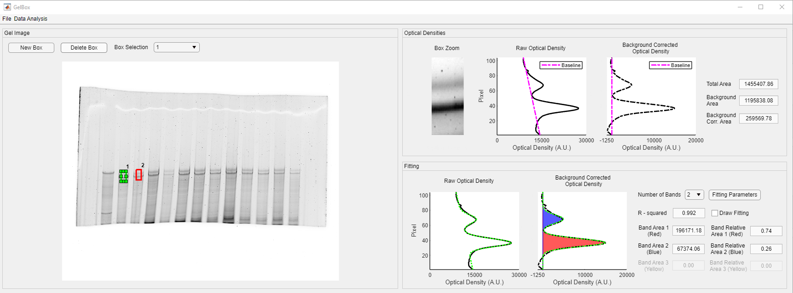

# Load analysis

This page provides simple instructions on how to load an existing analysis to GelBox 3.

## Instructions

+ Using the GelBox 3 through the cloned repository
    - Launch MATLAB and double click `GelBox.mlapp`. It is located under `<repo>app` folder. 
    - The `GelBox.mlapp` file starts the MATLAB App Designer, then press <kbd>F5</kbd> to start the application.

+ Using the GelBox 3 as a stand alone application
    - ... 
    - ...

After a few seconds, you should see a program window. This is the main GelBox program. (Clicking on any of the images on this page will open a larger version in a new browser window.)

Click the File button on the toolbar. The file button opens a dropdown menu, which is highlighted in a red rectangle in the image below. click the Load Analysis button.

This button brings up a Windows File Open Dialog. Locate and load the GelBox analysis file. To learn how to save a GelBox 3 analysis, please follow the [start new analysis tutorial](../start_new_analysis/start_new_analysis.html).

After a few seconds, the analysis is loaded to the interface. All the operations described in [start new analysis tutorial](../start_new_analysis/start_new_analysis.html) are available upon loading.

