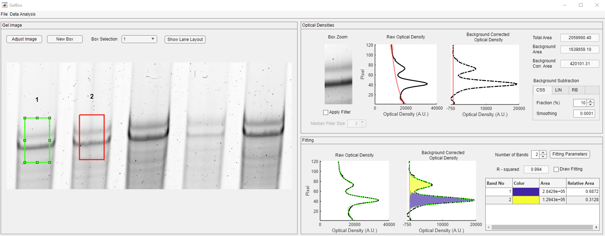

## GelBox

GelBox is open-source software that was developed with the goal of enhancing rigor, reproducibility, and transparency when analyzing gels and immunoblots. It combines image adjustments (cropping, rotation, brightness, and contrast), background correction, and band-fitting in a single application. Users can also associate each lane in an image with metadata (for example, sample type). GelBox data files integrate the raw data, any supplied metadata, image adjustments, and band-level data in a single file to improve traceability. GelBox has a user-friendly interface and was developed using MATLAB. 

