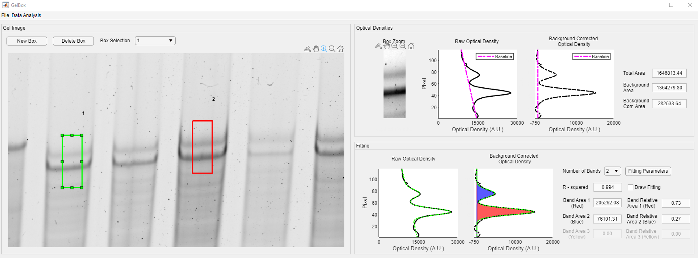
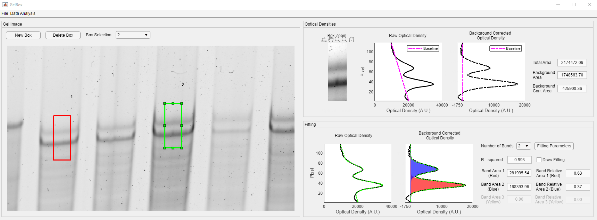
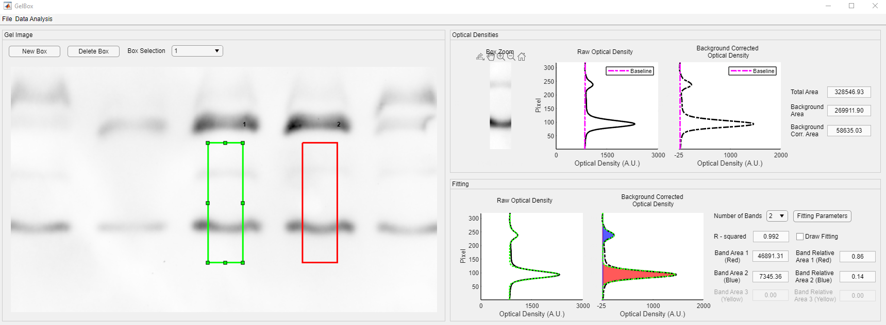
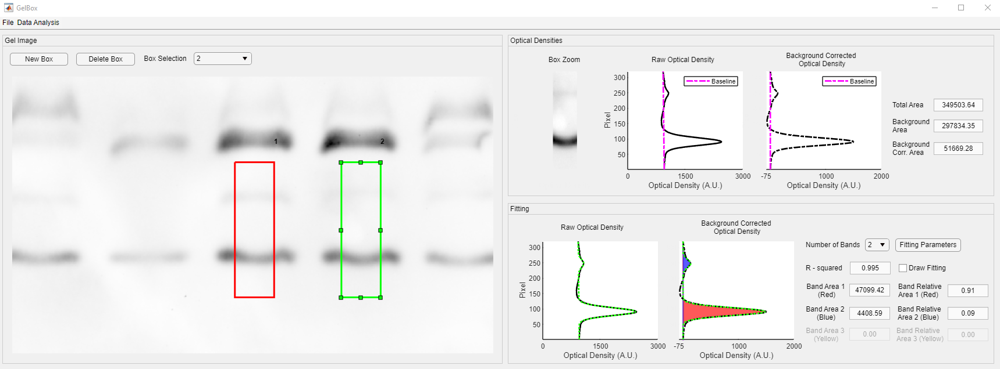
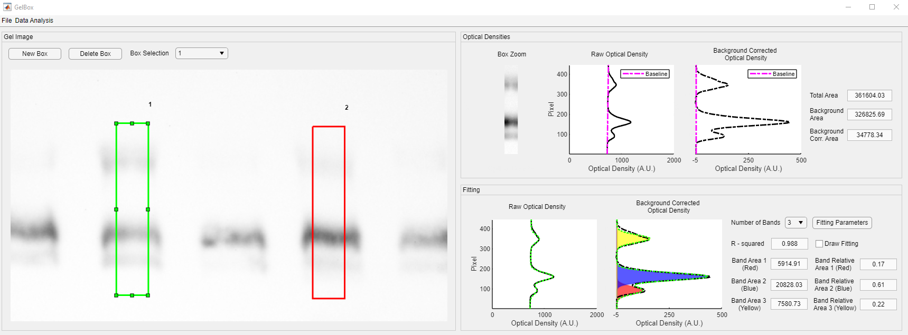
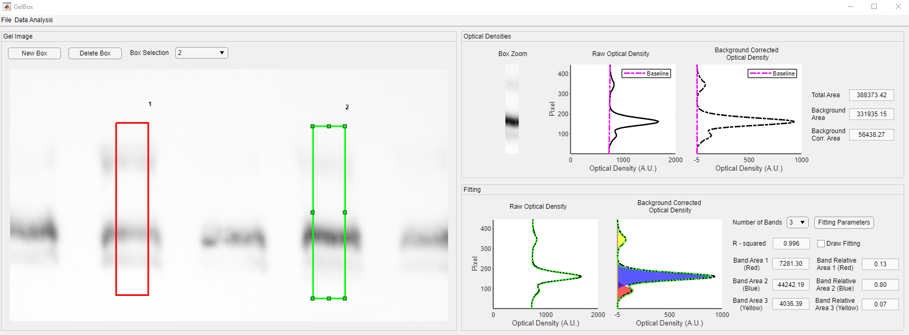

# Examples
This page shows the GelBox screenshots of the demonstrated gel analysis in the manuscript. Clicking on any of the images on this page will open a larger version in a new browser window.

## Titin Gel Example
### Titin Gel Box 1

### Titin Gel Box 2

## RLC Phosphorylation Phos-Tag Gel Example

### RLC Phosphorylation Phos-Tag Gel Box 1

### RLC Phosphorylation Phos-Tag Gel Box 2

## TnI Phosphorylation Phos-Tag Gel Example

### TnI Phosphorylation Phos-Tag Gel Box 1

### TnI Phosphorylation Phos-Tag Gel Box 2

