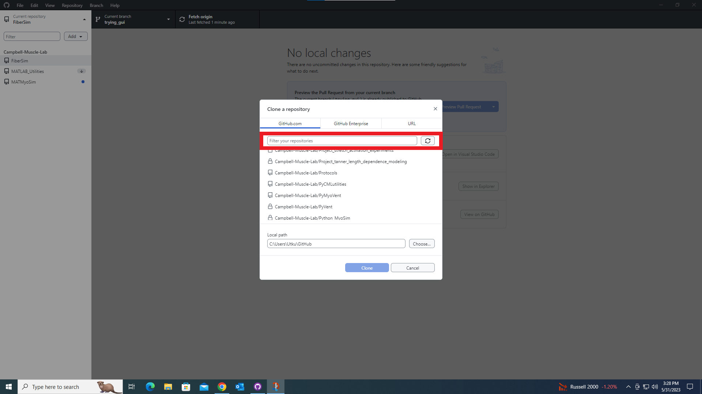
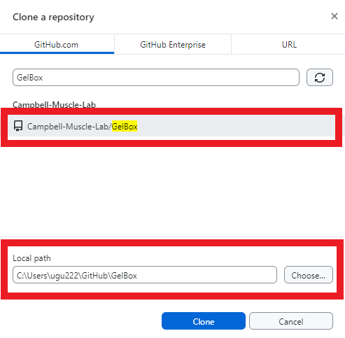

# Installation

## Cloning GelBox

This page instructs you on how to clone the GelBox repository.

For cloning the GelBox repository, we recommend using the [GitHub Desktop client.](https://desktop.github.com/)

Clicking on any of the images on this page will open a larger version in a new browswer window.

Open GitHub Desktop and click the dropdown menu for repositories (shown in red rectangle in below image).

Click the “Add” dropdown menu (shown in red rectangle in below image).

Click the “Clone repository…” button (shown in red rectangle in below image).

Type “GelBox” into the repository search bar (shown in red rectangle in below image).

Click the Campbell-Muscle-Lab/GelBox repository, describe where you would like the repository to be located on your local machine (both shown in red rectangles in below image).

