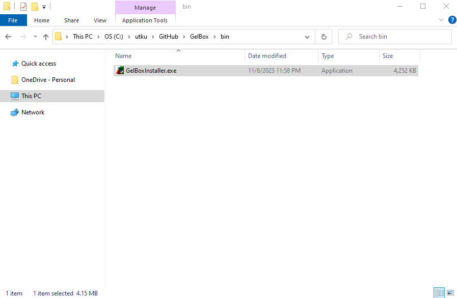
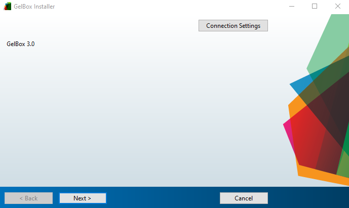
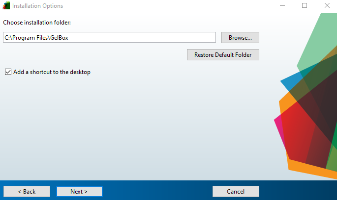
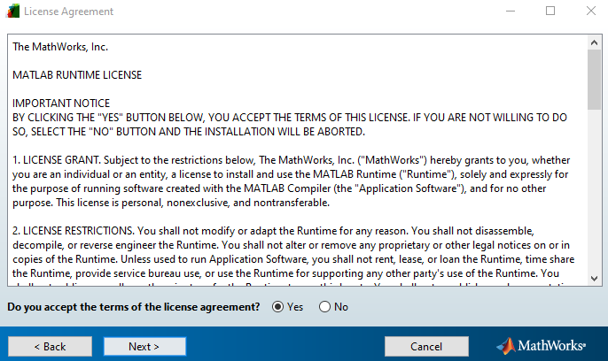
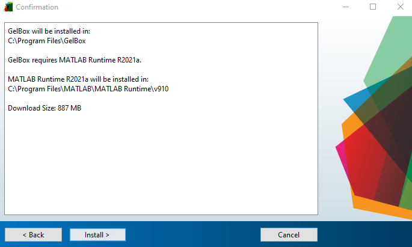
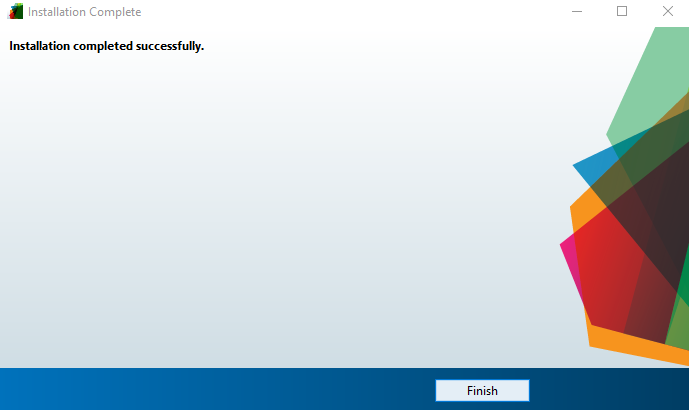

# Installation

## Instructions for Stand Alone Application Installation

This page instructs you on how to install GelBox as a stand-alone application.

+ The installer file can be downloaded from the [GitHub page](https://github.com/Campbell-Muscle-Lab/GelBox/tree/master/bin/median_filtering_27Mar24). 27Mar24 installer is the current GelBox build. In this case, the installer file is located under your designated Downloads folder.
+ Users can also clone the GelBox repository and access the zipped installer file. The installer file is located under `<repo>bin`. The instructions on how to clone a repository can be found [here](../cloning_gelbox/cloning_gel_box.html).

Locate the installer file on your computer and unzip it. Once the installer is unzipped, double-click the `GelBoxInstaller.exe` file.

The installer starts in a few seconds and then click Next.

The installer asks users to select the installation folder and then click Next.

In the next step, the installer asks the folder for the MATLAB Runtime. The MATLAB Runtime will be automatically downloaded from the internet in the later steps. Click Next to continue.

MATLAB Runtime License agreement is needed for the runtime installation, click Yes for the license agreement and Next to continue.

MATLAB Runtime is ready to be downloaded. Click Next to proceed.

The download may take some time depending on the internet connection.

Once the download is completed, press Finish.

Now GelBox is ready to be used.
