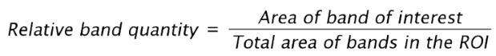

# Methods

GelBox fits the summation of Gaussian functions to the density profile using a workflow that is similar to [GelBandFitter](https://campbell-muscle-lab.github.io/GelBandFitter/). Such mathematical function is defined as follows: 

where x is the position along the height of the region of interest (ROI), n is the number of bands, Ai and xi are the peak amplitude, and its location, respectively, α determines the width, and ϕ is the skew parameter. The equation can be used for any finite number of bands.

Each parameter alters the shape of the function. While the peak amplitude sets the maximum value, its location shifts the curve along the x direction (Panels A and B in the below figure). As the α parameter increases, the curve's width decreases (Panel C in the below figure). A non-zero skew parameter allows the function to be asymmetric (Panel D in the below figure). GelBox estimates the width and skew parameters for the first band, then they are shared through the bands with an offset term. GelBox sets offset terms 0 assuming the proteins run in similar shapes. This assumption can be overwritten through adjustable starting parameter estimates.

GelBox adjusts the parameters for each Gaussian function until the minimum residual sum of squares of the density profile and fitted function is obtained. Such objective function is defined as follows:

where k is the number of pixels in the ROI, D(x) is the densitometry profile, S(x) is the fitted function at the end of each iteration. Each Gaussian function is then numerically integrated, using the Simpson's rule, to find the areas. Generalized relative band content expression is given as follows:

When $a \ne 0$, there are two solutions to $ax^2 + bx + c = 0$ and they are:
$$x = {-b \pm \sqrt{b^2-4ac} \over 2a}.$$
