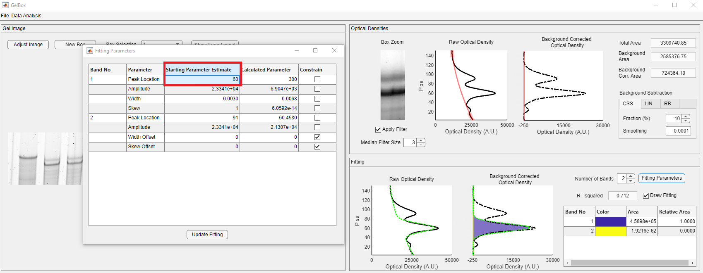
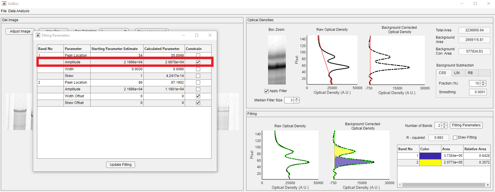
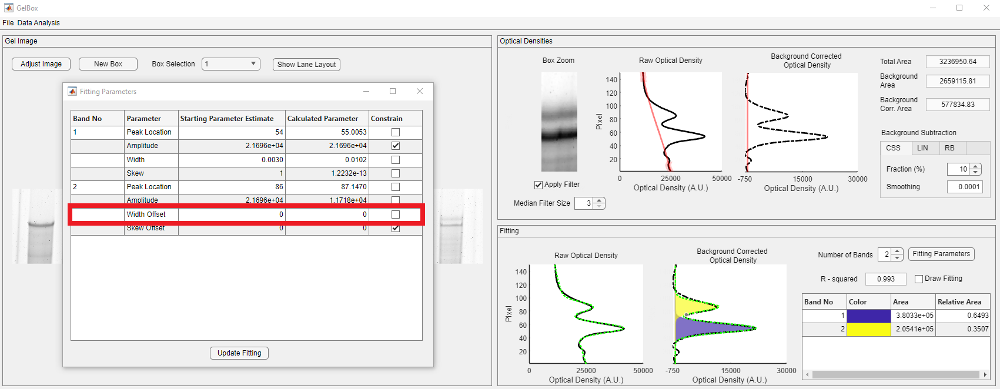

# Troubleshooting

This page provides simple troubleshooting steps for analysis with GelBox. Clicking on any of the images on this page will open a larger version in a new browser window.

Here's an example of a situation you might encounter with your gels. Please note that the fitted function does not properly represent the density profile. The application only captures one peak, so there is only one non-zero Gaussian function.

The problem is that the software has not found a good fit. There are two distinct possibilities.

+ There is not  a good mathematical fit to the experimentally measured profile, and
+ There is a good fit, but GelBox could not find it.

It is not always easy to identify the situation. One possible first step is visualizing the fitting process to observe how the function develops through iterations. Draw Fitting checkbox, shown in the red rectangle, lets users visualize fitting. As soon as the box is checked, the fitting starts over. This may take a little longer as each fitting iteration is plotted simultaneously.

<video src="media/draw_fitting.mp4" controls="controls" style="max-width: 730px;"></video>

The first couple of iterations show that the application does not accurately predict the peak locations. Click the Fitting Parameters in the Fitting panel for the starting parameter estimates. Although the peak locations are roughly around 60 and 90 for band 1 and band 2, both peaks are wrongly estimated.

Change the peak location of band 1 to 60 and click the Update Fitting button.

Please note that GelBox successfully detected the two peaks after changing the peak locations. You can look for better fits by changing the size and position of the region of interest (ROI) box.

Change the peak estimate of the peak one and constrain it to capture the amplitude accurately. Use the constrain checkbox, shown in the red rectangle.

After constraining the peak amplitude, the new fit accurately predicts the peak amplitude.

Further improvement can be made by changing the width offset of the second band using the Fitting Parameters.

These troubleshooting steps obtain an acceptable R-squared value for the fitted function. In addition, both bands are represented with non-zero Gaussian functions.