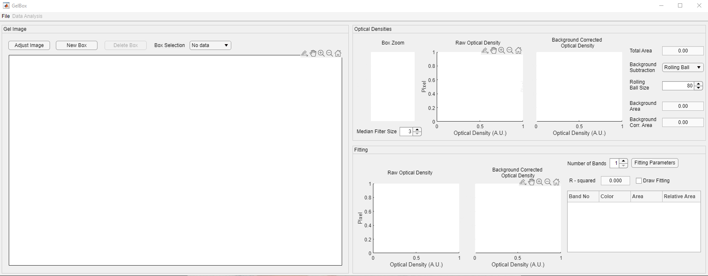
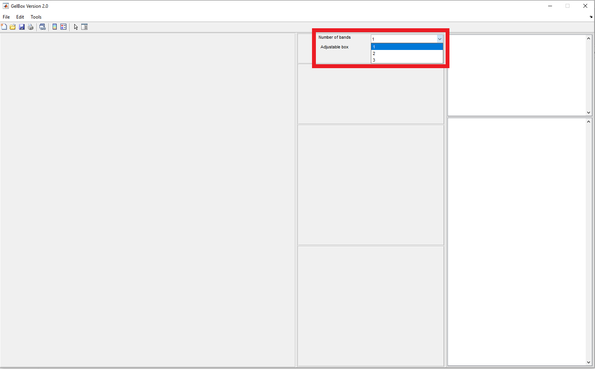
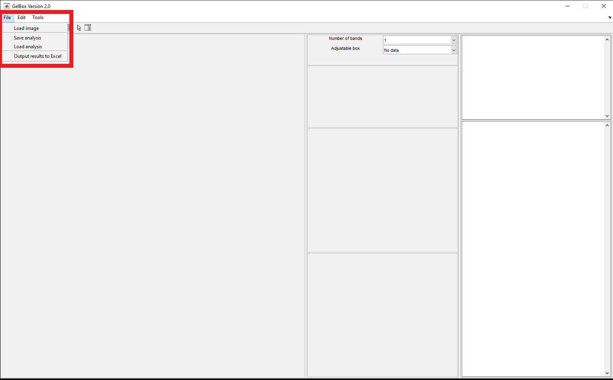
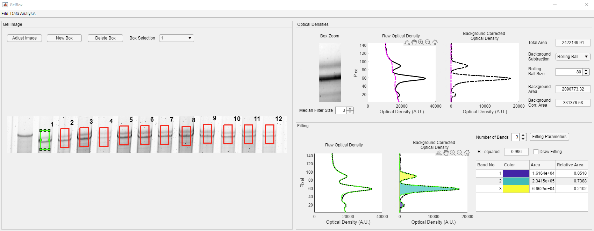

# Load analysis

This page provides simple instructions on how to load an existing analysis to GelBox.

## Instructions

## Instructions

+ Launch MATLAB and open `GelBox.m`. It is located under `<repo>code` folder.
+ Press <kbd>F5</kbd> to run the file.

After a few seconds, you should see a program window. This is the main GelBox program. (Clicking on any of the images on this page will open a larger version in a new browswer window.)

First select the number of bands used in the GelBox analysis using the number of bands dropdown menu (red rectangle).

Click the 'File' button. File button opens a dropdown menu, which is highlighted in red rectangle in the image below. click the 'Load Analysis' button in the dropdown menu.

This button brings up a normal Windows File Open Dialog. Use this to load the GelBox analysis file. To how to save a GelBox analysis please follow the [start new analysis tutorial](../start_new_analysis/start_new_analysis.html).

After few seconds, the analysis is loaded to GelBox. All the operations described in [start new analysis tutorial](../start_new_analysis/start_new_analysis.html) are available upon loading.

