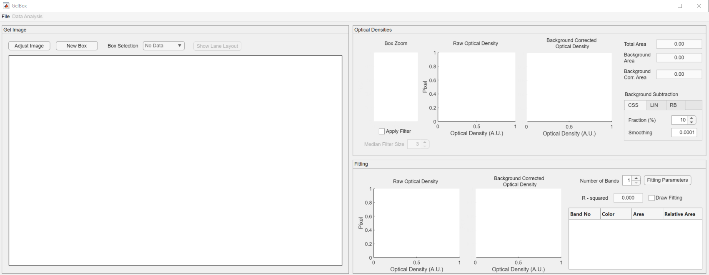
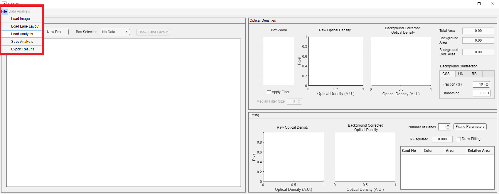
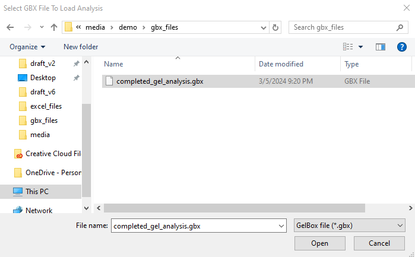
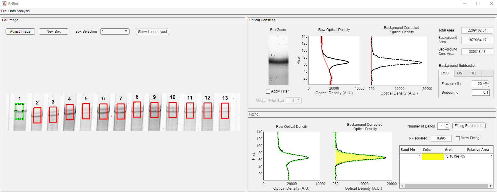

# Load analysis

This page provides simple instructions on how to load an existing analysis to GelBox.

## Instructions

+ Using the GelBox through MATLAB:
    - Launch MATLAB and navigate to the Apps tab on the top menu. Find the GelBox under My Apps and start the application by clicking it. The instructions on how to locate the Apps tab can be found [here](../../installation/installing_matlab_app/installing_matlab_app.html)

+ Using the GelBox as a stand-alone application:
    - Locate your `GelBox.exe` shortcut and start the application by double-clicking it.

After a few seconds, you should see a program window. This is the main GelBox program. (Clicking on any of the images on this page will open a larger version in a new browser window.)

Click the File button on the toolbar. The file button opens a dropdown menu, which is highlighted in the red rectangle in the image below. Click the Load Analysis button.

This button brings up a Windows File Open Dialog. Locate and load the GelBox analysis file. To learn how to save a GelBox analysis, please follow the [start new analysis tutorial](../start_new_analysis/start_new_analysis.html).

After a few seconds, the analysis is loaded to the interface. All the operations described in [start new analysis tutorial](../start_new_analysis/start_new_analysis.html) are available upon loading.

Image adjustments are also loaded and can be reviewed using the Adjust Image button.

