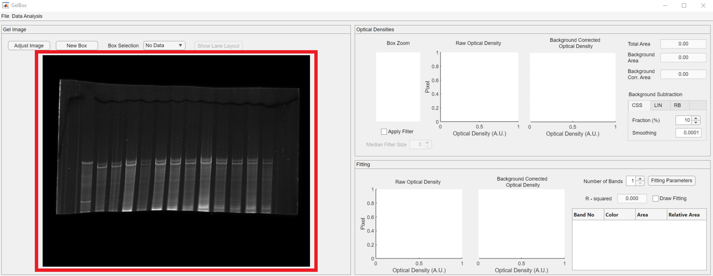

# Start new analysis

This page provides simple instructions on how to perform a new analysis with GelBox.

## Instructions

+ Launch MATLAB and open `GelBox.m`
+ Press <kbd>F5</kbd> to run the file.

After a few seconds, you should see a program window. This is the main GelBox program. (Clicking on any of the images on this page will open a larger version in a new browswer window.)

The first step in new analysis is to load an image file. You do this by clicking the 'File' button. File button opens a dropdown menu, which is highlighted in red rectangle in the image below. click the 'Load Image' button in the dropdown menu.

This button brings up a normal Windows File Open Dialog. Use this to load an image file. GelBox can open a TIF and PNG files.

Please note that the file format is selected as TIF in the red rectangle. This can be switched to PNG using the file extension dropdown. Press open to load the image.

An image of your gel should now be displayed in the left panel (red rectangle). The top right panel consists the variety of information on the image file (blue rectangle).

GelBox can work with both flourescent and non-flourescent images. In the case of a flourescent image, click the 'Tools' button in the toolbar to reveal the 'Invert Image' button (red rectangle).

Clicking 'Invert Image' button transforms bright pixels to dark pixels and vice versa. The inverted image appears in the left panel.

In this tutorial, we are interested in analyzing the top two bands. First, change the number of bands to 2 (red rectangle). GelBox can analyze relative quantities of 1, 2, or 3 bands using a summation of 1, 2, or 3 Gaussian functions, respectively.

You can now zoom into the the lane of interest by using scroll wheel of the mouse or changing the mouse cursor mode to MATLAB's zoom in feature. This feature appears on the top right corner of the image axes. It is hidden, but as you hover over the image it appears.

The next step is to draw a box for analysis. Click the 'Edit' button in the toolbar, it opens the 'New Box' button (red rectangle). This operation can be also performed using the `Ctrl+N` shortcut.

The newly generated box appears as light green. The GelBox automatically calculates the fit using the provided information by the user. The middle panel displays different portions of the analysis:
+ An inset figure is diplayed in the middle panel (red rectangle). Please note that the inset image can be seem to be darker than the original. It is because of the "scaled image display" option by MATLAB, in which the pixel intensities are scaled with respect to maximum available pixel intensity. This is used for display purposes, it doesn't impact the calculation. 
+ In purple rectangle, the raw optical density (black line) is plotted. The fitted function, which is the summation of two Gaussian functions in this case, is shown in red dashed line. The Gaussian functions are highlighted in blue and red shaded areas. Magenta dashed line is the baseline.
+ The background corrected density (raw optical density - baseline) and fitted function traces are shown in solid black and dashed red lines, respectively. The blue and red circles show the individual Gaussian functions. The relative area under the Gaussian functions are given in the top right corner. The r2 value for each box is employed as a goodness of fit measure and shown at the title. 

The box can be resized and dragged along the image. The fitting process automatically follows the position of the box. You can explore a better fit by replacing or resizing the box.

<video src="media/move_resize_box.mp4" controls="controls" style="max-width: 730px;"></video>>

Usually, there are more than one lanes of interest in gels. Once you are completed with the current box, generate your next box as mentioned above. GelBox will automatically place a new box in the vicinity of the old box. All the boxes have the same dimensions. The new box becomes the selected box (light green) and the old box is shown in red.

Drag the new box to desired position. Please note that the inset and density figures are updated as the box moves.

You can change the selected box using the 'Adjustable box' dropdown menu.

The second box can be also dragged around the image. However, when the selected box is resizing, all the existing boxes change their size as well. Please note that the fits may change as a result of resizing. Make sure to check all the existing boxes to verify fits.

<video src="media/two_box_resize.mp4" controls="controls" style="max-width: 730px;"></video>>

Once you are done with your analysis, click the 'File' button to save your analysis and export figures and summary excel files.

'Save analysis' button opens the following file dialog box, which allows you to save GelBox analysis files in a special .gdf format. This file format can be loaded to GelBox to revisit analysis.

'Output results to Excel' button opens a file dialog box for the summary excel file.

Here is a snapshot of the excel file:
+ image_file: file path of the image
+ band: the box number
+ total_area: area under the raw density trace
+ background_area: area under the baseline
+ band_area_bottom: area under the Gaussian function representing bottom band
+ band_area_top: area under the Gaussian function representing top band
+ band_left: position of the upper left corner on the x axis
+ band_top: position of the upper left corner on the y axis
+ band_width: width of the box
+ band_height: height of the box
+ fitting_mode: number of Gaussian functions
+ num_of_bands: number of bands
+ r_squared: r2 value of the fit

Following the excel file export, an input dialog box appears to define the band labels for the output figures.

+ Box layout plot

+ r2 - box plot: red dashed line indicates the r2 value of 0.9

In addition to output figures two more excel files, one with the density trace and band fits for each box and one with the inset figures. Inset images are saved as an array, therefore reading this file as an image is essential for post processing.

+ gel_box_tutorial_fits
    - x: raw density value
    - y: pixel index along height of the box
    - x_fit: fitted function value
    - x_back: background density value
    - band_1: 1st Gaussian function value
    - band_2: 2nd Gaussian function value

+ gel_box_tutorial_insets
    - excel rows show the pixel index along height of the box
    - excel columns show the pixel index along width of the box

