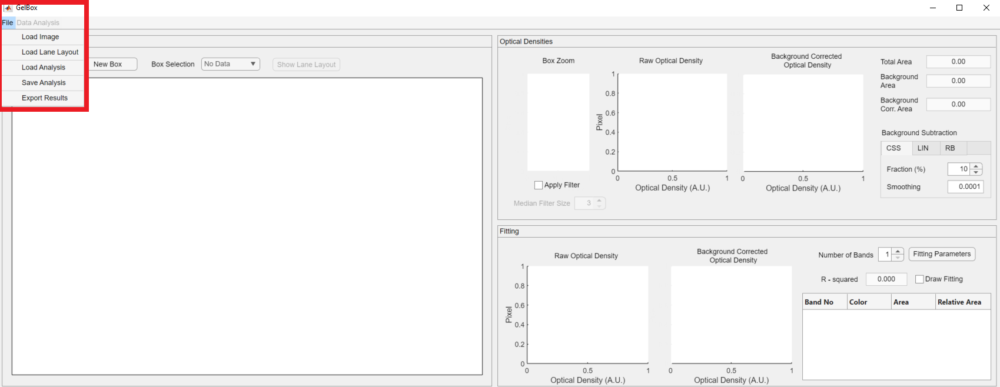
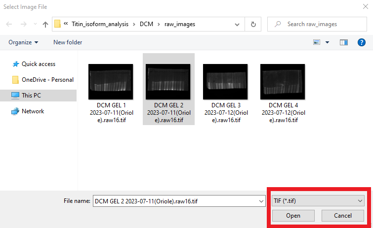
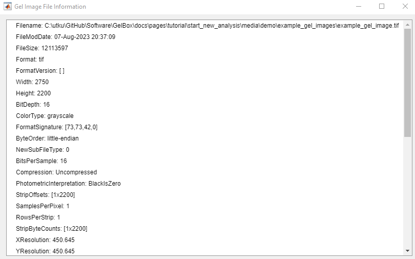
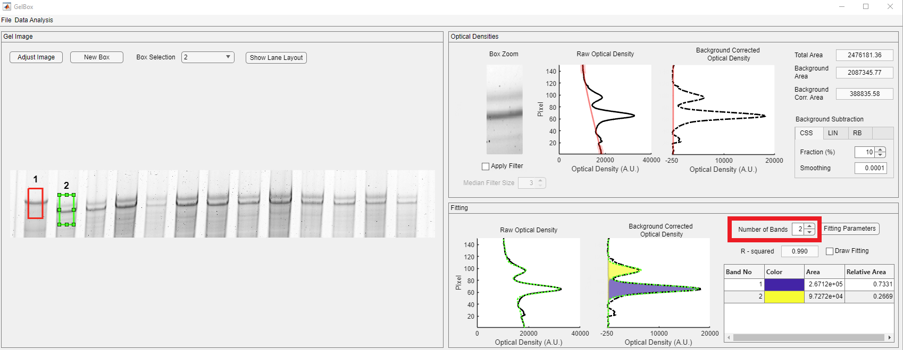
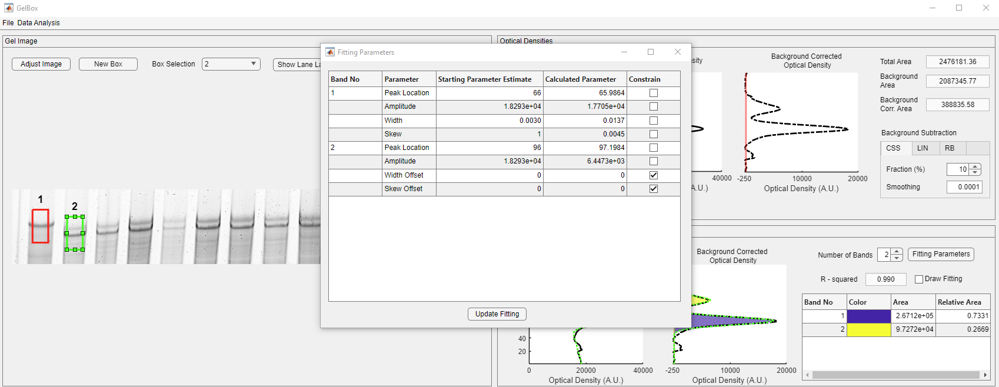
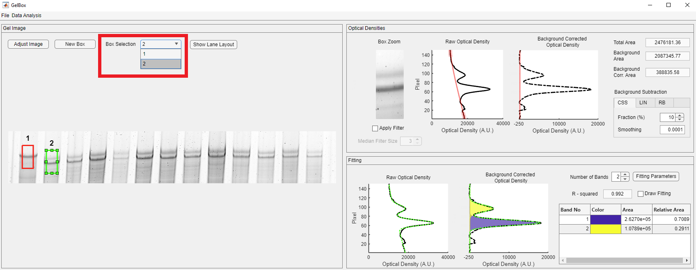
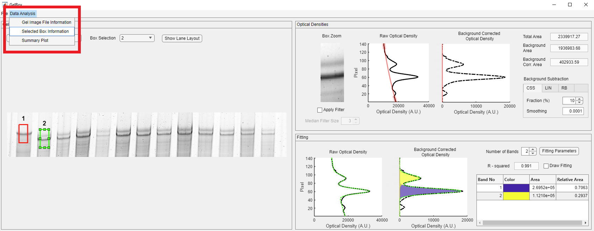
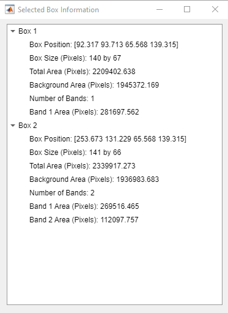
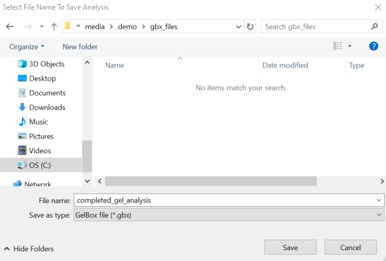
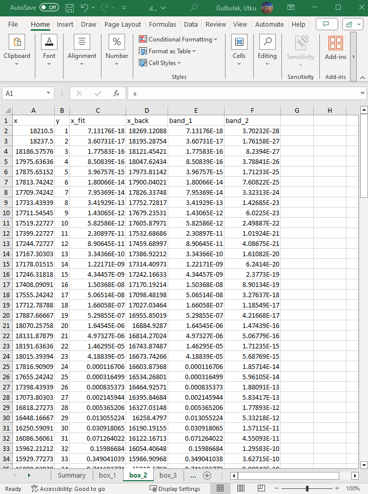

# Start new analysis

This page provides simple instructions on how to perform a new analysis with GelBox.

## Instructions

+ Using the GelBox through the cloned repository
    - Launch MATLAB and double click `GelBox.mlapp`. It is located under `<repo>app` folder. 
    - The `GelBox.mlapp` file starts the MATLAB App Designer, then press <kbd>F5</kbd> to start the application.

+ Using the GelBox as a stand alone application
    - ... 
    - ...

After a few seconds, you should see a program window. Here is the GelBox interface (Clicking on any of the images on this page will open a larger version in a new browser window.).

The interface is divided into three different panels. Their functionality is summarized as follows:
+ Gel Image: The image axes display the gel images. The main region of interest (ROI) box controls are located above the axes. Users can create and delete ROI boxes.
+ Optical Densities: It shows the ROI's raw and background corrected densitometry profiles. Box Zoom axes show an enlarged version of the enclosed area for a closer review.
+ Fitting: It shows the results of the curve fitting process. The main fitting controls are located in this panel.

The first step of the analysis with GelBox is to load an image file to the environment. The File button on the top menu opens a dropdown menu, shown in a rectangle. The first option of the dropdown is the Load Image.

Upon clicking the Load Image button, it opens a normal Windows File Open Dialog. Locate the folder which has the gel images on your computer. GelBox can work with PNG (Portable Network Graphics) and TIFF or TIF (Tag Image File Format) files. In this tutorial, the file format is selected as TIF in the red rectangle. This can be switched to PNG using the file extension dropdown. Select your gel image and click Open.

An image of your gel should now be displayed in the gel image panel (red rectangle).

GelBox can work with both fluorescent and non-fluorescent images. In the case of a fluorescent image, click the File button in the toolbar and click the Invert Image button (red rectangle).

Clicking the Invert Image button transforms bright pixels into dark pixels and vice versa. The inverted image appears in the Gel Image panel.

GelBox stores various information in the loaded image file. To access the image file information click the Data Analysis button on the toolbar, shown in the red rectangle.

Click the Gel Image File Information and open to open the below window.

In this tutorial, the loaded gel image is a titin gel. We are interested in quantifying the relative quantities of cardiac N2B and N2BA titin isoforms. The first lane of the gel is loaded with a skeletal control sample.

Zoom into the lane of interest by changing the mouse cursor mode to MATLAB's zoom-in feature. This feature appears on the top right corner of the image axes. It is hidden, but it appears as you hover over the image (shown in red rectangle).

Zoomed-in image shows the second, third, and fourth lane of the gel.

You can now zoom into the lane of interest by using the mouse's scroll wheel or changing the mouse cursor mode to MATLAB's zoom-in feature. This feature appears on the top right corner of the image axes. It is hidden, but it appears as you hover over the image.

The next step is to draw an ROI box for analysis. Box controls are placed above the image axes, shown in red rectangle.

After clicking the New Box button, the mouse cursor changes into a crosshair. Click on the image and expand the ROI to a desired size.

The newly generated box appears light green. The GelBox automatically processes the enclosed area in the ROI. Please note that all the empty axes and fields are populated now.

+ Optical Densities: In this panel, the contents of the ROI is displayed in the Box Zoom axes. Please note that the Boz Zoom image can be seem to be darker than the original. It is because of the "scaled image display" option by MATLAB, in which the pixel intensities are scaled with respect to the maximum available pixel intensity. This is used for display purposes and does not impact the calculation. The raw and background corrected optical densities are shown in solid black and dashed black lines, respectively. The baseline is shown in the dashed magenta line. Background corrected densitometry is obtained by subtracting the baseline from the raw density. Three different area values are automatically calculated.

    - Total Area: The area under the raw densitometry profile
    - Background Area: The area under the baseline
    - Background Corr. Area: The area under the background corrected densitometry profile

+ Fitting: The fitted function is displayed in a dashed green line in this panel. The red-shaded area in the Background Corrected Optical Density axes shows the area under the Gaussian function. The R-squared value is employed as a goodness of fit measure. Band Relative Area 1 is greyed out since the number of bands is selected as one. Since there are two bands in the ROI, click the Number of Bands dropdown, shown in the red rectangle, and change it to two. The fitting results are updated, and relative area values are calculated.
   - Band Area 1 (Red): The area under the Gaussian function highlighted in red
   - Band Area 2 (Blue): The area under the Gaussian function highlighted in blue
   - Band Relative Area 1 (Red): The relative area of Area 1, calculated as Rel. Area 1 = Area 1/(Area 1 + Area 2)
   - Band Relative Area 2 (Blue): The relative area of Area 2, calculated as Rel. Area 2 = Area 2/(Area 1 + Area 2)

The box can be resized and dragged along the image. The fitting process automatically follows the position of the box. You can explore a better fit by replacing or resizing the box.

<video src="https://github.com/utkugulbulak/gelbox_website/assets/98066302/e156c6f6-e5d5-48b2-92ae-33e476a74455" controls="controls" style="max-width: 730px;"></video>

The fitting parameters are initialized by GelBox and can be edited using the Fitting Parameters button (red rectangle) in the Fitting Panel.

Click the Fitting Parameters button, and it opens a new window. The window shows the tabulated estimated (beginning of the fitting) and calculated (end of the fitting) parameter values.

The Starting Parameter Estimates table is editable, except for the Band No column. Let's change the width offset value of band two from 0 to -0.0004, shown in the red rectangle in the Fittin Parameters window, then click the Update Fitting button in the red rectangle. This button starts over the fitting process with new starting parameters. Please note that changing the width offset results in a slightly better fit, and the relative area values are changed by 0.02, highlighted in the red rectangle below. You can also constrain the parameter values using the checkboxes so that GelBox will not adjust the selected parameter.

Usually, there is more than one lane of interest in gels. Once you are completed with the current box, generate your next box as mentioned above. GelBox will automatically place a new box near the old box. All the boxes have the same dimensions. The new box becomes the selected box (light green), and the old box is shown in red. Drag the new box to the desired position. Please note that the inset and density figures are updated as the box moves.

You can change the selected box using the Box Selection dropdown, shown in a rectangle. 

The second box can also be dragged around the image. However, when the selected box is resized, all the existing boxes also change their size. Please note that the fits may change as a result of resizing. Make sure to check all the existing boxes to verify fits.

<video src="https://github.com/utkugulbulak/gelbox_website/assets/98066302/a1493800-bb53-4a4a-b2af-a5830136c64f" controls="controls" style="max-width: 730px;"></video>

The new box positions, sizes, and area values can be accessed through the Selected Box Information window. Click the Data Analysis button on the toolbar, shown in the red rectangle. 

Clicking the Selected Box Information button opens the following window.

Once you finish your analysis, click the File button on the toolbar to save your analysis, shown in the red rectangle. The Save Analysis button opens the following file dialog box, which allows you to save GelBox analysis files in a unique .gdf format. This file format can be loaded to GelBox to revisit the analysis. Name your file and click Save.

The Export Results button opens a file dialog box for the summary Excel file. Name your file and click Save.

Summary Excel file has multiple sheets. The first sheet is the Summary sheet, and here are the brief descriptions of each column.
+ image_file: file path of the image
+ band: the box number
+ total_area: area under the raw density trace
+ background_area: area under the baseline
+ band_area_bottom: area under the Gaussian function representing the bottom band
+ band_area_top: area under the Gaussian function representing the top band
+ band_left: position of the upper left corner on the x-axis
+ band_top: position of the upper left corner on the y-axis
+ band_width: width of the box
+ band_height: height of the box
+ fitting_mode: number of Gaussian functions
+ num_of_bands: number of bands
+ r_squared: R-Squared value of the fit

The following sheets are named after the boxes. There is a sheet for each box in the analysis. Here are the brief descriptions of each column.
+ x: raw optical density value
+ y: pixel index along the height of the box
+ x_fit: fitted function value
+ x_back: background density value
+ band_1: 1st Gaussian function value
+ band_2: 2nd Gaussian function value

In addition, users can generate summary plots for their analysis. Click the Data Analysis button on the toolbar. The Summary Plot button is located at the bottom of the dropdown, shown in the red rectangle.

It opens a dialog box. The dialog box asks users to select the output folder, name the figure file, and define the band labels.

Fill the fields with information and then click the Generate Summary Plots button

After a couple of seconds, the following figure appears and is saved under the selected folder.

