# Start new analysis

This page provides simple instructions on performing a new analysis with GelBox.

## Instructions

+ Using the GelBox through the cloned repository:
    - Launch MATLAB and double click `GelBox.mlapp`. It is located under `<repo>app` folder. 
    - The `GelBox.mlapp` file starts the MATLAB App Designer, then press <kbd>F5</kbd> to start the application.

+ Using the GelBox as a stand-alone application:
    - ... 
    - ...

After a few seconds, you should see a program window. Here is the GelBox interface. (Clicking on any of the images on this page will open a larger version in a new browser window.).

The interface is divided into three different panels. Their functionality is summarized as follows:
+ Gel Image: The image axes display the gel images. The main region of interest (ROI) box controls are above the axes. Users can create and delete ROI boxes.
+ Optical Densities: It shows the ROI's raw and background corrected densitometry profiles. Box Zoom axes show an enlarged version of the enclosed area for a closer review.
+ Fitting: It shows the results of the curve fitting process. The main fitting controls are in this panel.

<a href="media/startup_window.png" target="_blank"></a>

The first step of the analysis with GelBox is to load an image file to the environment. The File button on the top menu opens a dropdown menu, shown in a rectangle. The first option of the dropdown is the Load Image.

<a href="media/load_file_button.png" target="_blank"></a>

Upon clicking the Load Image button, it opens a normal Windows File Open Dialog. Locate the folder which has the gel images on your computer. GelBox can work with PNG (Portable Network Graphics), TIFF (Tag Image File Format), BMP (Bitmap), GIF (Graphics Interchange Formats), JPEG (Joint Photographic Expert Group), JPEG 2000, PBM (Portable Bitmaps), and PGM (Portable Gray Map) images. In this tutorial, the file format is selected as TIF in the red rectangle. This can be switched to PNG using the file extension dropdown. Select your gel image and click Open.

<a href="media/file_open.png" target="_blank"></a>

An image of your gel should now be displayed in the gel image panel (red rectangle).

<a href="media/raw_gel.png" target="_blank"></a>

The loaded gel image has darker background, and users can obtain a brighter background image using the GelBox's built-in image adjustments window. To access the window, click the Adjust Image button in the red rectangle.

<a href="media/adjust_image.png" target="_blank">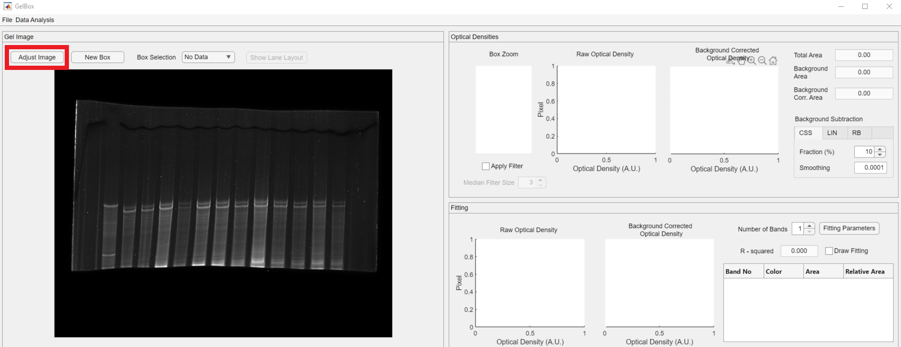</a>

The Adjust Image has three main panels. Their functionality is summarized as follows:
+ Original Image: The loaded gel image before the modifications are shown in the panel. The color bar indicates the pixel intensity values in the image. The image adjustment controls are placed in the panel, namely Crop Image, Invert Image, Accept Changes, and Revert Changes.
+ Brightness and Contrast: It shows the pixel intensity histogram of the original (teal bars and left y-axis label) and the adjusted (purple bars and right y-axis label) image. The controls for brightness and contrast are placed in this panel.
+ Adjusted Image: It shows the adjusted image.

The Invert Image checkbox, shown in the red rectangle, lets users to invert (darker pixels become brighter, and vice versa) their images.

<a href="media/adjust_image_window.png" target="_blank">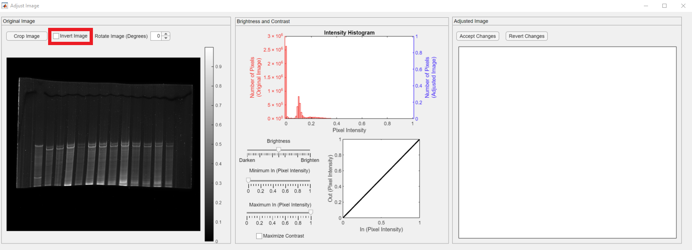</a>

Upon clicking the Invert Image checkbox, the inverted image appears in Adjusted Image panel. 

Clicking the Invert Image button transforms bright pixels into dark pixels and vice versa. The inverted image appears in the Gel Image panel. In addition, the adjusted image intensity histogram appears in the plot. Please note that the both teal and purple histograms are symmetric.

<a href="media/invert_image.png" target="_blank"></a>

In this tutorial, the loaded gel image is a titin gel. We are interested in quantifying the relative quantities of cardiac N2B and N2BA titin isoforms. The first lane of the gel is loaded with a skeletal control sample. We are interested in the two bands that appeared around the mid height of the gel. The rest of te gel image does not hold useful information. Therefore, the next step is to crop the image for the analysis. The Crop Image button, shown in red rectangle, is in the Original Image panel.

<a href="media/crop_image.png" target="_blank">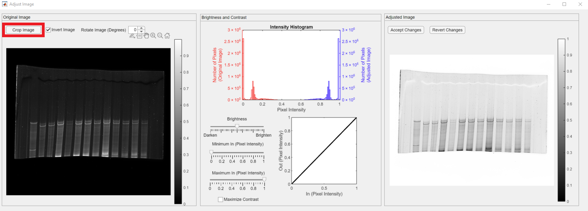</a>

The Crop Image button changes the mouse cursor into a crosshair and lets users select a rectangular enclosing (shown in green) in the original image. Please note that the adjusted image is changed to the cropped image and values on the right y axis (purple) are reduced as the total number of pixels is decreased.

<a href="media/cropped_image.png" target="_blank">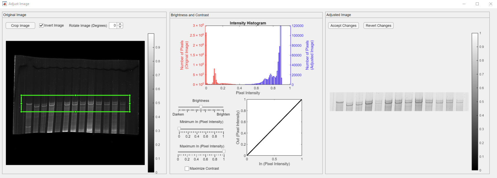</a>

The box is stationary, yet it can be dragged around or resized. The histogram and the adjusted image displays would be updated in that case.

The visibility of the image can be adjusted by changing the brightness or adjusting the contrast by mapping the pixel intensities. During these operations, GelBox keeps track of the "over-saturated" pixels. If a pixel is "over-saturated," it would be highlighted as red in the adjusted image panel. Please note that this feature is only for visual quality control purposes and will not modify the image with red pixels.

<video src="https://github.com/Campbell-Muscle-Lab/GelBox/assets/98066302/a3f1254b-5ef8-48f0-a0b0-e8cb60241115" controls="controls" style="max-width: 730px;"></video>

Once the image is adjusted and ready for quantification, click the Accept Changes button, shown in red rectangle, to transfer the adjusted image to the GelBox environment.

<a href="media/accept_image_adjustments.png" target="_blank">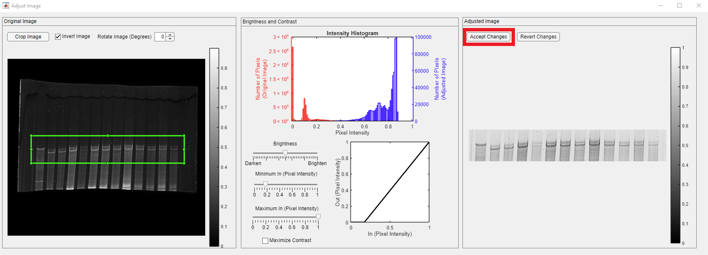</a>

Following the click the Adjust Image window is closed, and all the adjustments are stored for analysis export at the end.

<a href="media/adjusted_image_new_box.png" target="_blank">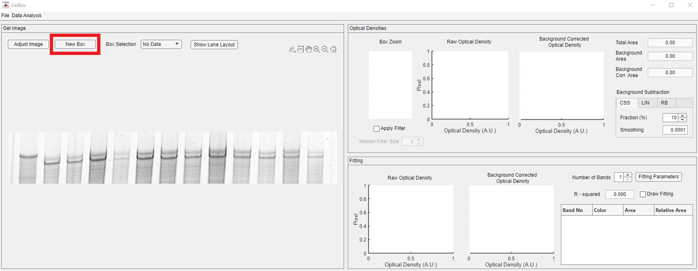</a>

The next step is to draw an ROI box for analysis. Box controls are placed above the image axes, shown in red rectangle. After clicking the New Box button, the mouse cursor changes into a crosshair. Click on the image and expand the ROI to a desired size.

<a href="media/num_of_bands_one.png" target="_blank">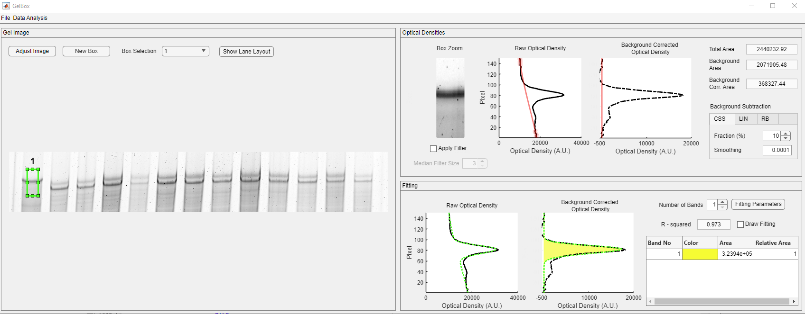</a>

The newly generated box appears light green. The GelBox automatically processes the enclosed area in the ROI. Please note that all the empty axes and fields are populated now.

In the Optical Densities panel, the contents of the ROI are displayed in the Box Zoom axes. Please note that the Boz Zoom image can be seen to be darker than the original. It is because of MATLAB's "scaled image display" option, in which the pixel intensities are scaled to the maximum available pixel intensity. This is used for display purposes and does not impact the calculation. The raw and background-corrected optical densities are shown in solid black and dashed black lines. The baseline is shown in the dashed magenta line. Background-corrected densitometry is obtained by subtracting the baseline from the raw density. Three different area values are automatically calculated.

    - Total Area: The area under the raw densitometry profile
    - Background Area: The area under the baseline
    - Background Corr. Area: The area under the background corrected densitometry profile

GelBox implements median filtering to diminish the effects of the experimental artifacts, such as speckles. The default median filter size is 3, which defines the size of the square matrix around the center pixel. Users can change the filter size depending on the artifacts' size. The Median Filter Size spinner is shown in the red rectangle below.

<a href="media/med_filter_10.png" target="_blank"></a>

By default, GelBox uses the rolling ball background subtraction to eliminate the effects of the uneven background staining. The selection of the rolling ball size is the most essential feature of the process. The rolling ball size should have a minimal impact on the quantification and converse as much raw data as possible. Users can change the rolling ball radius in pixels through the Rolling Ball Size spinner, shown in the red rectangle.  

<a href="media/rolling_ball_5.png" target="_blank"></a>

In the above example, the radius of 5 for the rolling ball removed almost all of the raw data. 

Users can also use Linear or Constant Value methods for background subtraction. The other methods can be accessed through the Background Subtraction dropdown menu, shown in the red rectangle.

<a href="media/background_methods.png" target="_blank"></a>

The linear method estimates the background by connecting the density profile's beginning and end with a straight line.

<a href="media/linear_background.png" target="_blank">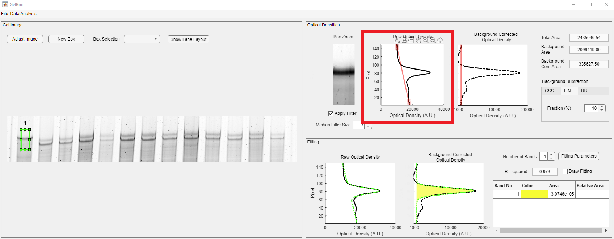</a>

The constant value method subtracts a density value from the density profile.

<a href="media/constant_background.png" target="_blank"></a>

Both linear and constant value methods removed experimental data and performed poorly compared to the rolling ball method. Therefore, the tutorial continues with a rolling ball with a radius of 80 pixels background subtraction for quantification.

In the Fitting panel, the fitted function is displayed in a dashed green line in this panel. The yellow-shaded area in the Background Corrected Optical Density axes shows the area under the Gaussian function. The R-squared value is employed as a goodness-of-fit measure. The Band table shows the list of the bands and their color designation. The color designation follows the [Parula colormap](https://blogs.mathworks.com/steve/2014/10/13/a-new-colormap-for-matlab-part-1-introduction/). The enumeration starts from the bottom of the density profile. The area is given in pixels, and the relative area is 1 as the number of bands is selected as one. Users can increase the number of bands in the ROI using the Number of Bands spinner, shown in red rectangle.

<a href="media/num_of_bands_one.png" target="_blank"></a>

<a href="media/num_of_bands_two.png" target="_blank"></a>

Upon changing the number of bands, GelBox automatically calculates the new Gaussian fit and updates all the fields. Please note that the color code has changed. While the purple-shaded area shows Band 1, the yellow-shaded area shows Band 2. The relative quantities are calculated as:

Relative Quantities = Area of the Band of Interest / The Total Area of the Bands in the ROI.

The box can be resized and dragged along the image. The fitting process automatically follows the position of the box. You can explore a better fit by replacing or resizing the box.

<video src="https://github.com/Campbell-Muscle-Lab/GelBox/assets/98066302/70c0725e-e50c-491d-8a33-6679e17b11a0" controls="controls" style="max-width: 730px;"></video>

GelBox does not have a limit for the number of bands for the fitting. The density profile has a small peak towards the bottom of the ROI; increase the number of bands to 3 using the spinner.

<a href="media/num_of_bands_three.png" target="_blank"></a>

GelBox placed the new Gaussian function (teal-shaded area) inside one of the functions. Users can change the estimated fitting parameters to obtain better fits. The Fitting Parameters button in the red rectangle opens the fitting parameters table. 

 The window shows the tabulated estimated (beginning of the fitting) and calculated (end of the fitting) parameter values. The constraints are also listed in the table as checkboxes.

<a href="media/fitting_parameters_dialog.png" target="_blank"></a>

The bottom peak is around the 20-pixel mark, and GelBox is estimated to have a peak of around 36. The Starting Parameter Estimate column is editable, and change that to 20; the changes are shown in red rectangle. You can also constrain the parameter values using the checkboxes so that GelBox will not adjust the selected parameter. After editing, click the Update Fitting button, shown in red rectangle, to reperform the Gaussian function fitting.

<a href="media/change_fitting_parameter.png" target="_blank">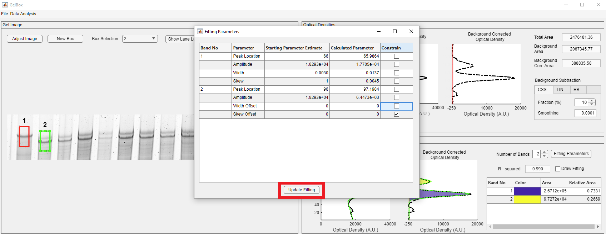</a>

The new estimate successfully captured the bottom peak in the density profile. The relative quantities are automatically updated. Please note that the color scheme is changed.

<a href="media/fitting_parameters_changed.png" target="_blank">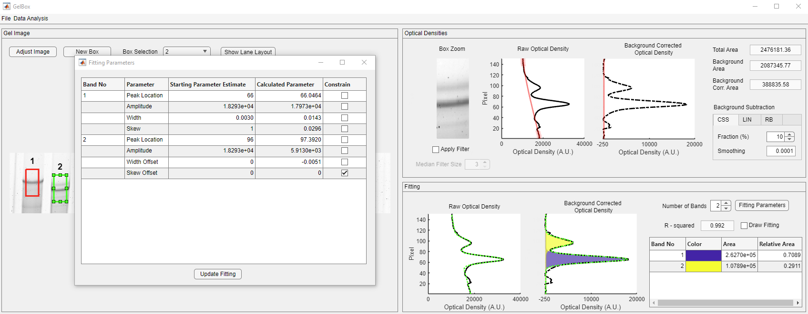</a>

Usually, there is more than one lane of interest in gels. Once you complete the current box, generate your next box as mentioned above. GelBox will automatically place a new box near the old box. All the boxes have the exact dimensions. The new box becomes the selected box (light green), and the old box is shown in red. Drag the new box to the desired position. Please note that the inset and density figures are updated as the box moves.

<a href="media/new_box_2.png" target="_blank">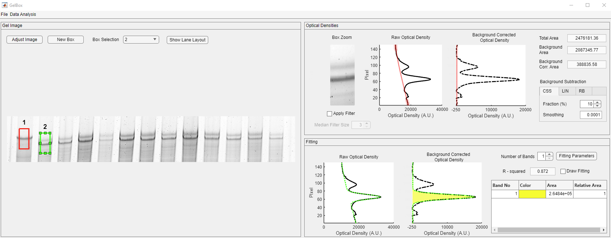</a>

You can change the selected box using the Box Selection dropdown, shown in a rectangle. 

<a href="media/adjustable_boxes.png" target="_blank"></a>

The second box can also be dragged around the image. However, when the selected box is resized, all the existing boxes also change size. Please note that the fits may change because of resizing. Make sure to check all the existing boxes to verify fits.

<video src="https://github.com/Campbell-Muscle-Lab/GelBox/assets/98066302/824790a9-ae88-452c-b06e-d59907143ee7" controls="controls" style="max-width: 730px;"></video>

The new box positions, sizes, and area values can be accessed through the Selected Box Information window. Click the Data Analysis button on the toolbar in the red rectangle. 

<a href="media/selected_box_information_menu.png" target="_blank"></a>

Users can also access the Gel Image Information window and review the stored image information.

<a href="media/gel_image_information.png" target="_blank"></a>

The rest of the analysis is shown in the below video.

<video src="https://github.com/Campbell-Muscle-Lab/GelBox/assets/98066302/b0acf20f-835f-43b2-a037-5994806d9821" controls="controls" style="max-width: 730px;"></video>

Here is the snapshot of the completed analysis.

<a href="media/complete_analysis.png" target="_blank">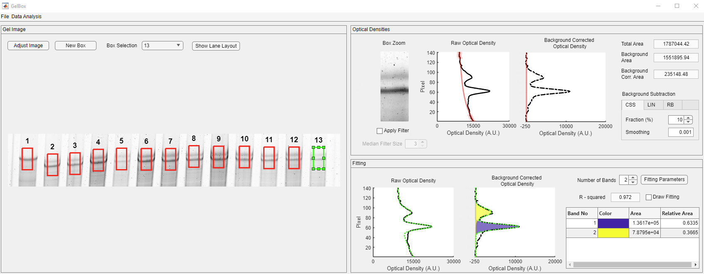</a>

Once you finish your analysis, click the File button on the toolbar to save your analysis, shown in the red rectangle. 

<a href="media/save_analysis.png" target="_blank">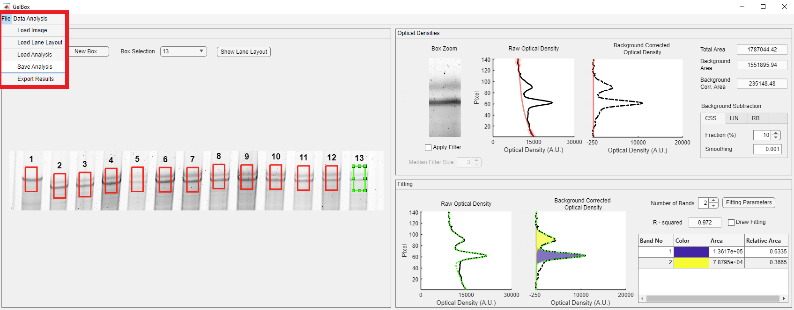</a>

The Save Analysis button opens the following file dialog box, which allows you to save GelBox analysis files in a unique .gbx (short for GelBox) format. .gbx files store the raw image, adjusted image, analysis, and the used settings. This file format can be loaded to GelBox to revisit the analysis. Name your file and click Save.

<a href="media/save_analysis_file_dialog.png" target="_blank"></a>

In addition to the .gbx file, the settings are exported in a JSON (JavaScript Object Notation) file. The .gbx file and the settings JSON file take a little less than 12 MB of space, which makes them easy to share between researchers.

<a href="media/output_folder.png" target="_blank">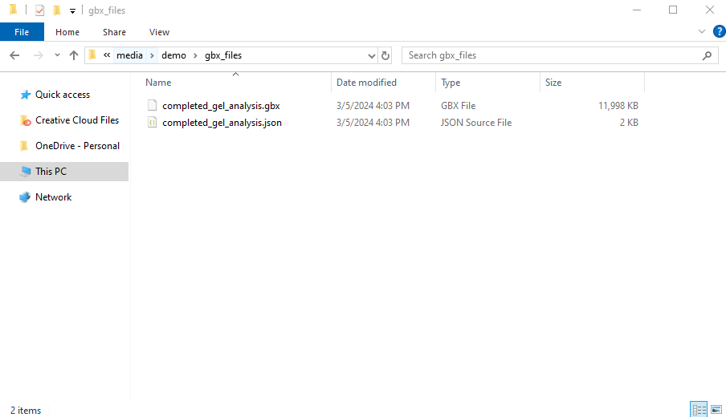</a>

The settings JSON file has the following structure. 

```
{
    "GelBox Settings": {
        "image_adjustments": {
            "crop_pos": [324.9267516,972.5992343,2124.492569,280.8016878],
            "brightness": 0,
            "contrast_lower": 0.2,
            "contrast_upper": 1,
            "max_contrast": 0
        },
        "background": {
            "method": [
                "Rolling Ball",
                "Rolling Ball",
                "Rolling Ball",
                "Rolling Ball",
                "Rolling Ball",
                "Rolling Ball",
                "Rolling Ball",
                "Rolling Ball",
                "Rolling Ball",
                "Rolling Ball",
                "Rolling Ball",
                "Rolling Ball"
            ],
            "size": [80,80,80,80,80,80,80,80,80,80,80,80]
        },
        "filtering": {
            "median": {
                "size": [3,3,3,3,3,3,3,3,3,3,3,3]
            }
        }
    }
}
```

The Export Results button opens a file dialog box for the analysis summary Excel file. You can combine your gel layout Excel files with the analysis Excel file to improve traceability. First, GelBox asks users to select the name of the Analysis Results Excel file. Name your file and click Save.

<a href="media/output_results_file_dialog.png" target="_blank">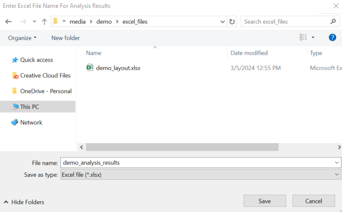</a>

Then, GelBox asks users to locate the gel layout file.

<a href="media/gel_layout_file_dialog.png" target="_blank">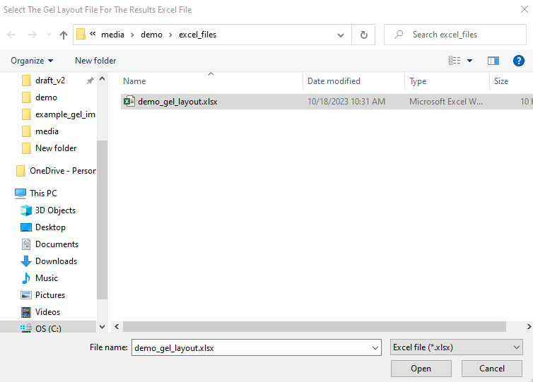</a>

The snapshot of the gel layout Excel is given below.

<a href="media/demo_gel_layout.png" target="_blank">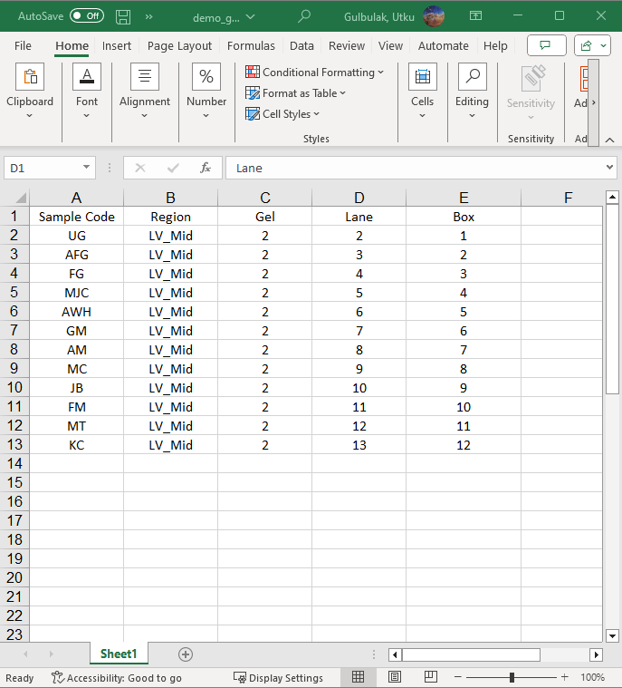</a>

GelBox uses the "Box" as the key for joining the tables in the backend. Please make sure to have "Box" in your layout. If the "Box" is not found, GelBox returns a warning window.

Here is the snapshot of the Analysis Summary Excel file.

<a href="media/results_excel_file.PNG" target="_blank">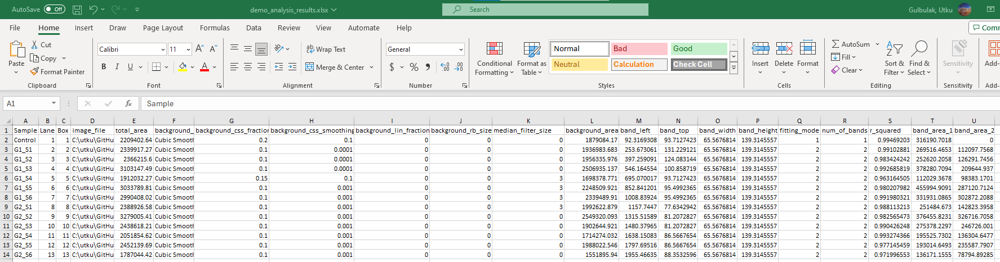</a>

Summary Excel file has multiple sheets. The first sheet is the Summary sheet, and here are the brief descriptions of each column:
+ (Optional) SampleCode: Identifier for the host of the samples
+ (Optional) Region: The region of the sample
+ (Optional) Gel: The gel number that was run
+ (Optional) Lane: The lane number in which the sample was loaded
+ box: The box number
+ image_file: File path of the image
+ total_area: Area under the raw density trace
+ background_method: Implemented background correction method
+ background_size: The size of the structural element for correction
+ background_area: The Area under the baseline
+ band_left: Position of the upper left corner on the x-axis
+ band_top: Position of the upper left corner on the y-axis
+ band_width: Width of the box
+ band_height: Height of the box
+ fitting_mode: Number of Gaussian functions
+ num_of_bands: Number of bands
+ r_squared: R-Squared value of the fit
+ band_area_1: Area under the first Gaussian function representing the first band
+ band_area_2: Area under the second Gaussian function representing the first band
+ band_area_3: Area under the second Gaussian function representing the first band 

The following sheets are named after the boxes. There is a sheet for each box in the analysis. Here are the brief descriptions of each column.
+ x: Raw optical density value
+ y: Pixel index along the height of the box
+ x_fit: Fitted function value
+ x_back: Background density value
+ band_1: The first Gaussian function value
+ band_2: The second Gaussian function value
+ band_3: The third Gaussian function value

<a href="media/excel_fits.png" target="_blank"></a>

In addition, users can generate summary plots for their analysis. Click the Data Analysis button on the toolbar. The Summary Plot button is located at the bottom of the dropdown, shown in the red rectangle.

<a href="media/summary_plot_dropdown.png" target="_blank">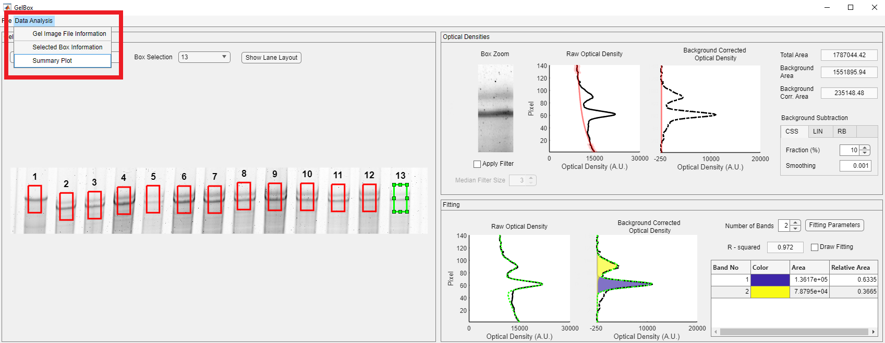</a>

It opens the Summary Plot window. The window asks users to select the output folder, name the figure file, define the band labels and the control lanes, if any.

<a href="media/summary_plot_window.png" target="_blank">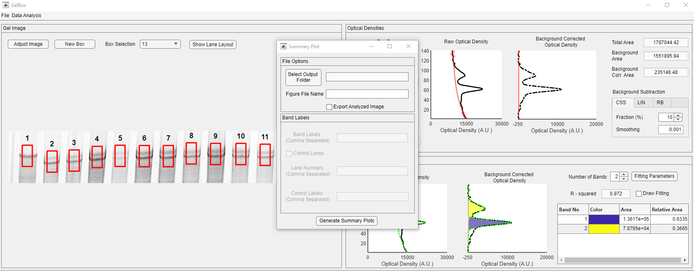</a>

The Select Output Folder button opens the following folder dialog. Select your desired folder and fill the rest of the fields. Then click the Generate Summary Plots button.

<a href="media/summary_plot_folder.png" target="_blank">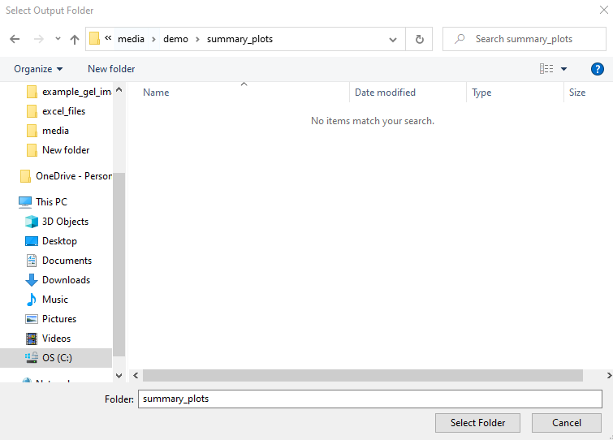</a>

<a href="media/filled_summary_plot_dialog.png" target="_blank">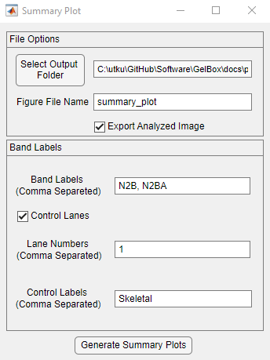</a>

After a few seconds, the following figure appears and is saved under the selected folder.

<a href="media/demo/summary_plots/summary_plot_box_layout_same_scale.png" target="_blank">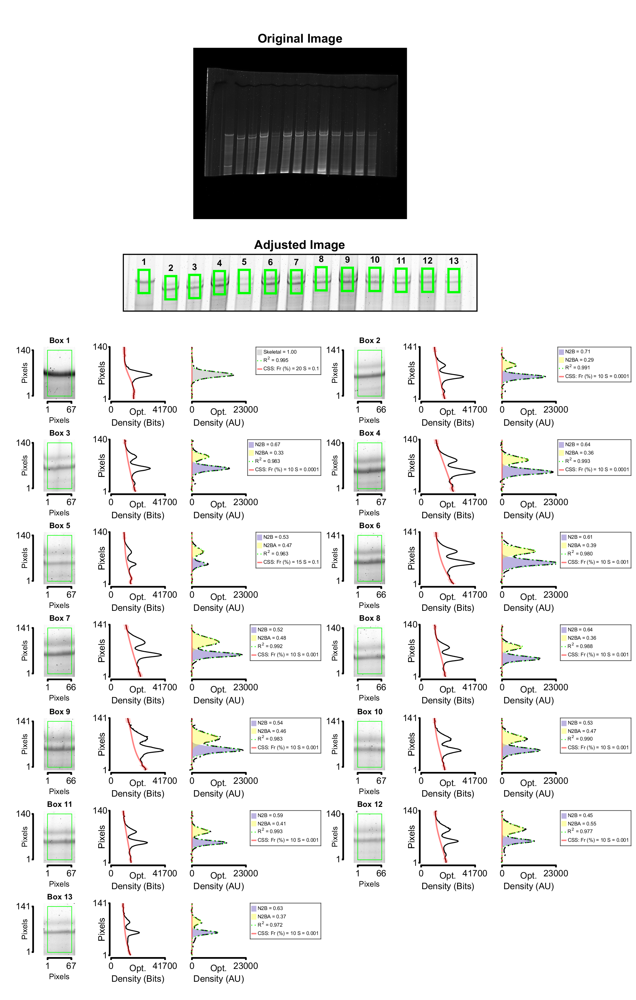</a>

